# Task Management Web Application

## Introduction
The application enables registered and authenticated users to create personal tasks, organize them according to various criteria, and manage these tasks through options like deletion and renaming. Users can also assign tasks to other registered members. This project was created in December 2022, at the beginning of my career path. The project was created using Create React App, which is now considered outdated.

## Technology Stack
- **React**: A JavaScript library for building user interfaces.
- **Redux Toolkit**: A toolset for efficient Redux development.
- **TypeScript**: A typed superset of JavaScript that compiles to plain JavaScript.
- **MUI Components**: A popular React UI framework.
- **JSON Server**: A simple project to setup a REST API with JSON data.

## Installation and Setup
1. **Prerequisites**:
   - Install Node.js and npm.
2. **Getting Started**:
   - Clone the repository: `git clone https://github.com/Hrumstik/TaskMaster.git`.
   - Navigate to the project directory and install dependencies: `npm install`.
   - Start the application: `npm start`.
  
## Screenshots

This section showcases screenshots of the main features of the application.
### Login Page
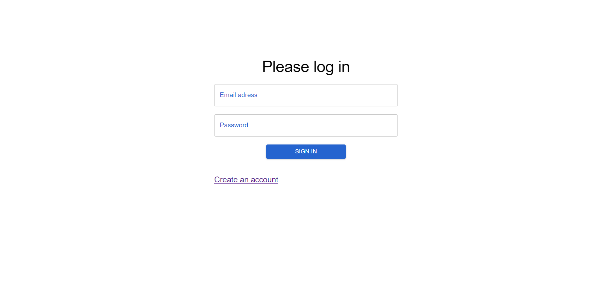
### Registration Page
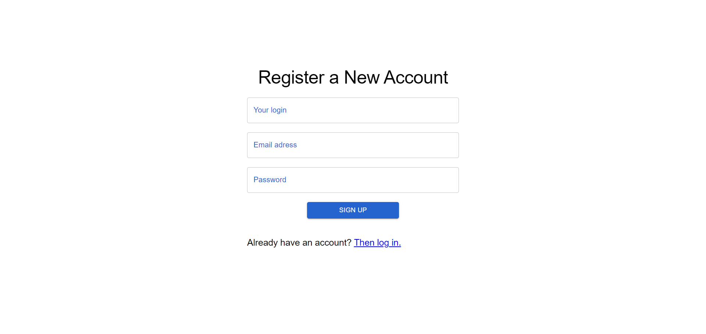
### Main Page
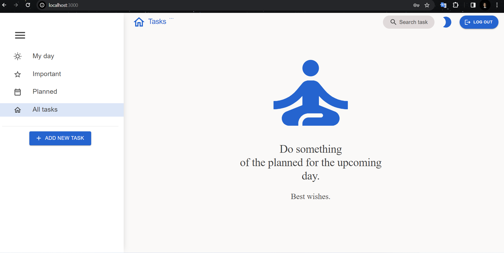
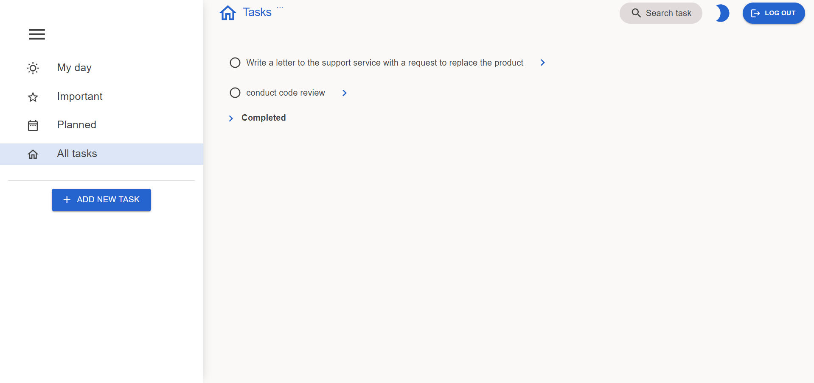
### Task creation process
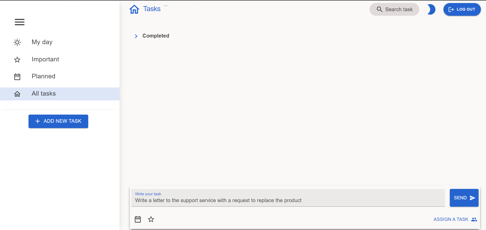
### The process of setting the importance of a task by clicking on the star, and setting the responsible registered users for the task
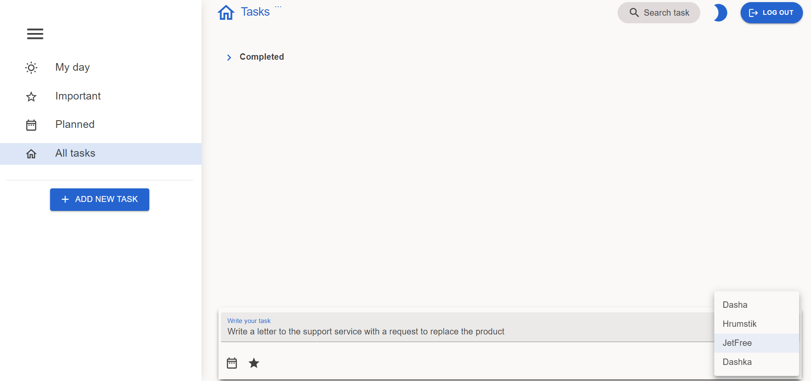
### The process of setting task execution time
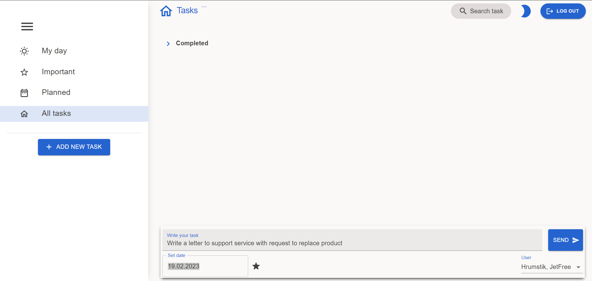
### The process of changing the task
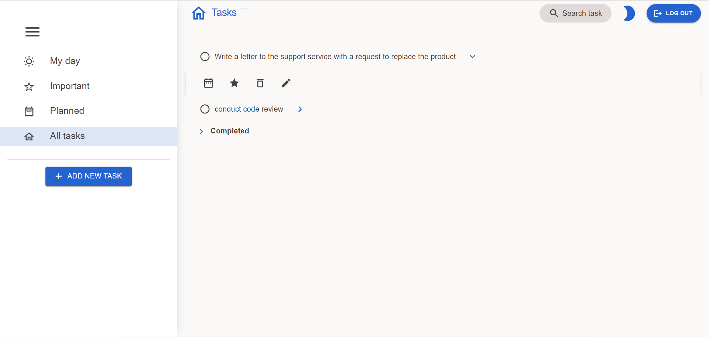
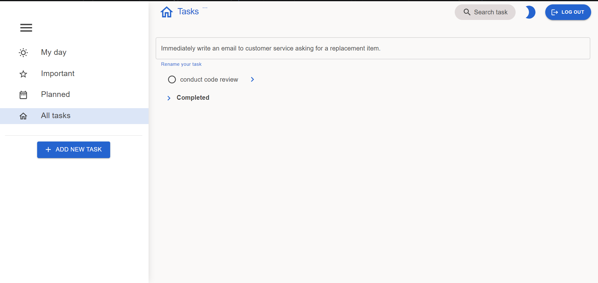
### Dark Theme
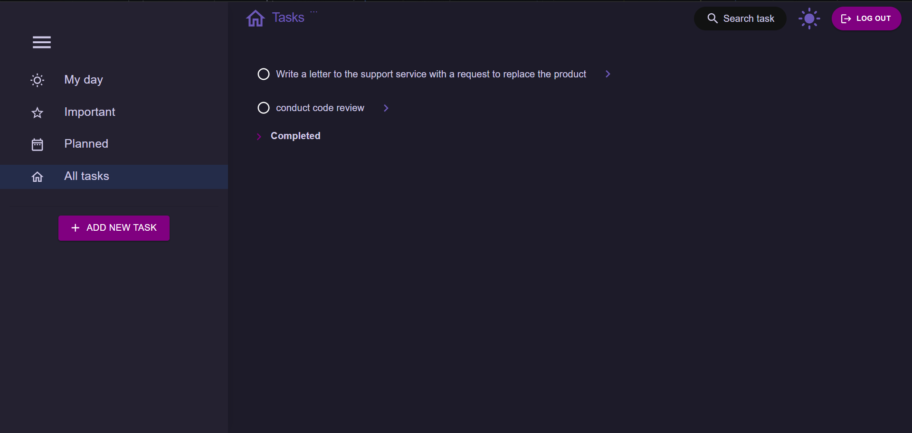
### Sorting tasks
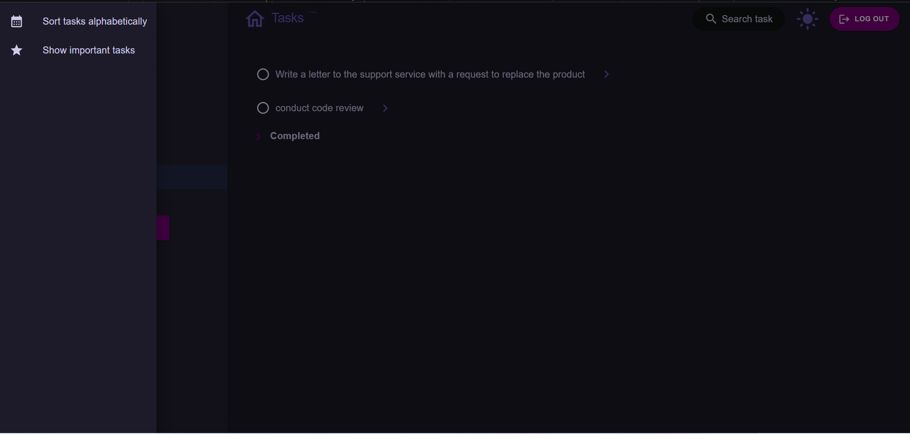

